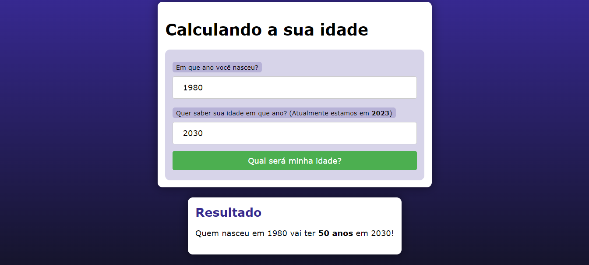

# MAQUINA DO TEMPO
👨‍🏫PROJETO CRIADO PARA O CURSO DE PHP DO CURSO EM VIDEO.

 <br>

## DESCRIÇÃO:
Este aplicativo é uma "Máquina do Tempo" que calcula a idade de uma pessoa em um ano específico. O usuário insere o ano de nascimento e o ano futuro (ou passado) para o qual deseja calcular a idade. O aplicativo então exibe a idade que a pessoa terá (ou teve) naquele ano.

- **Entrada:**
  - Ano de nascimento: 1990
  - Ano desejado: 2030

- **Saída:**
  - "Quem nasceu em 1990 vai ter **40 anos** em 2030!"

- **Campos Obrigatórios:** Ambos os campos ("Ano de nascimento" e "Ano desejado") são obrigatórios e devem ser preenchidos.
- **Validação:** Certifique-se de inserir anos válidos (números inteiros).
- **Ano Atual:** O ano atual é considerado 2023, conforme mencionado na descrição do campo.

## EXECUTANDO O PROJETO:
1. **Executando o Aplicativo com Apache:**
   - Coloque os arquivos em um servidor web compatível com PHP (por exemplo, XAMPP, WAMP, LAMP).
   - Acesse o formulário no navegador visitando [http://localhost/CODIGO/index.php](http://localhost/CODIGO/index.php).

2. **Executando o Aplicativo com `php.exe`:**
   - Alternativamente, você pode iniciar o servidor diretamente no diretório `./CODIGO` com o comando abaixo:
   ```bash
   php -S localhost:8080
   ```
   - Em seguida, acesse o formulário no navegador através do endereço: [http://localhost:8080](http://localhost:8080).

3. **Interagir com o Projeto:**
   1. **Abrir a Página Inicial**
      - Ao abrir a página inicial do aplicativo, você verá um formulário com campos para inserir o ano de nascimento e o ano em que deseja saber sua idade.

   2. **Inserir os Dados**
      - Insira o ano em que você nasceu no campo "Em que ano você nasceu?".
      - Insira o ano futuro ou passado no campo "Quer saber sua idade em que ano?".

   3. **Enviar o Formulário**
      - Clique no botão "Qual será minha idade?" para enviar o formulário. O aplicativo processará os dados inseridos e calculará a idade.

   4. **Visualizar o Resultado**
      - A página será recarregada e exibirá o resultado abaixo do formulário. O resultado mostrará a idade que você terá no ano especificado.
   
## CREDITOS:
- [PROJETO CRIADO PARA O CURSO DE PHP](https://github.com/VILHALVA/CURSO-DE-PHP)
- [PROJETO FEITO PELO VILHALVA](https://github.com/VILHALVA)


